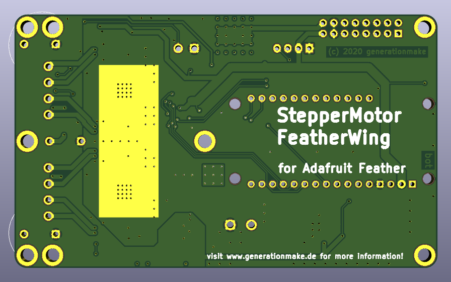

# StepperMotorFeatherWing
StepperMotorFeatherWing with Trinamic TMC5130A-TA drivers for two stepper motors compatible with Adafruit Feather 

## PCB

### Top

### Bottom

## pin usage

| **Pin** | **Pin Name** | **Signal**    | **Description**                |
|:-------:|:------------:|:-------------:|:------------------------------:|
| 1       | RESET        | RESET         |                                |
| 2       | 3V3          | 3V3-rail      | supply voltage for board       |
| 3       | AREF         | not connected |                                |
| 4       | GND          | GND           |                                |
| 5       | A0           | VIN_MEAS      | input voltage sense            |
| 6       | A1           |               |                                |
| 7       | A2           |               |                                |
| 8       | A3           |               |                                |
| 9       | A4           | EMERGENCYSTOP | EMERGENCYSTOP                  |
| 10      | A5           |               |                                |
| 11      | 15/SCK       | SCK           | SPI                            |
| 12      | 16/MOSI      | MOSI          | SPI                            |
| 13      | 14/MISO      | MISO          | SPI                            |
| 14      | 0/RX         |               |                                |
| 15      | 1/TX         |               |                                |
| 16      | D7           |               |                                |
| 17      | D11/SDA      | SDA           | I2C for temperature sensor     |
| 18      | D12/SCL      | SCL           | I2C for temperature sensor     |
| 19      | 5            | CS1A          | chip select stepper1 option A  |
| 20      | 6            | CS2A          | chip select stepper2 option A  |
| 21      | 9            | CS1B          | chip select stepper1 option B  |
| 22      | 10           | CS2B          | chip select stepper2 option B  |
| 23      | 11           |               |                                |
| 24      | 12           |               |                                |
| 25      | 13           |               |                                |
| 26      | VBUS         |               |                                |
| 27      | EN           |               |                                |
| 28      | BAT          |               |                                |

## Software

Demo-Software for this project is hosted in another repository:

https://github.com/generationmake/StepperMotorFeatherwingSW

### i2c addresses

| address | device | comment            |
|---------|--------|--------------------|
| 0x4B    | LM75   | temperature sensor |

## License

This hardware is licensed under the CERN OHL v. 1.2

